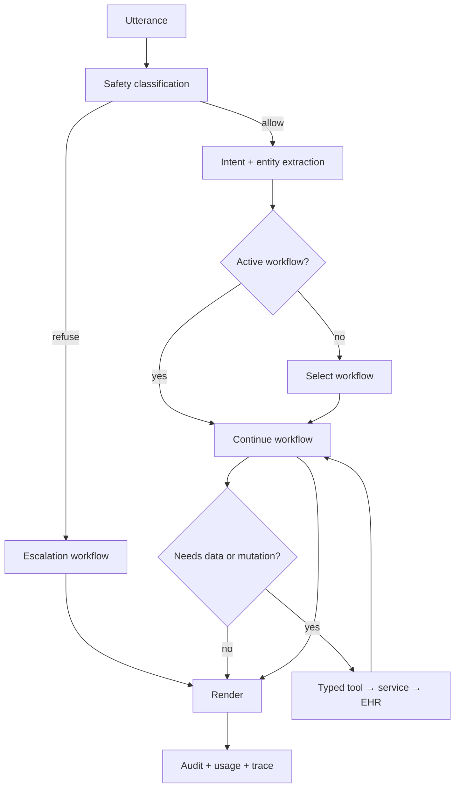

# Agent design

## The five roles

Confusing these is how agent systems become unmaintainable, so they are named explicitly.

| Role | Responsibility | Deterministic? | Example |
|---|---|---|---|
| **Orchestrator** | Owns session state; per turn: classify → route → execute → render | Mostly (LLM only for intent/entities/wording) | `agents/orchestrator.py` |
| **Workflow** | One multi-turn business process as an explicit state machine | Fully | `workflows/existing_patient_booking.py` |
| **Tool** | A typed, validated, callable capability exposed to the LLM | Fully | `tools/scheduling_tools.py::book_appointment` |
| **Service** | Business rules and orchestration over the EHR/repos | Fully | `services/scheduling_service.py` |
| **Safety policy** | Allow / constrain / refuse-and-escalate | Fully | `safety/medication_rules.py` |

**Not every component needs an LLM.** Most of this system is ordinary software. The model
is used where language understanding is genuinely required, and nowhere else.

## What the LLM does — and does not

**LLM is appropriate for**
- intent recognition
- entity extraction (names, dates, medication mentions, appointment reasons)
- resolving conversational references — "Tuesday", "the second one", "the same doctor"
- choosing among the available workflows
- natural conversational wording of an already-decided response

**Deterministic code owns**
- verification state and authorisation
- scheduling constraints and conflict detection
- patient record access
- medication lookup and **verbatim** dosage retrieval
- refill state transitions
- safety policies and escalation rules
- every EHR/database mutation
- audit logging, usage metering, budget enforcement

The required write path, with no exceptions:

```
LLM → typed tool → service → EHR adapter → FHIR server
```

## Turn lifecycle



Safety runs **first**, before intent, before any workflow, before any tool. It cannot be
reached by a path that skips it.

## Session state

```python
class SessionState(BaseModel):
    session_id: str
    channel: Literal["text", "voice", "phone"]
    verification: VerificationState        # UNVERIFIED | PENDING_SECOND_FACTOR | VERIFIED | FAILED
    patient_ref: str | None                # set only by the verification service
    active_workflow: WorkflowName | None
    workflow_state: dict[str, Any]         # offered slots, pending confirmation, ...
    turns: list[Turn]
    usage: SessionUsage
```

`patient_ref` is writable **only** by the verification service. No workflow, tool, or
model output can set it.

## Workflows

| Workflow | Requires verification |
|---|---|
| `verification` | — |
| `existing_patient_booking` | ✅ |
| `new_patient_booking` | — (creates the record) |
| `appointment_management` | ✅ |
| `medication_lookup` | ✅ |
| `refill_request` | ✅ |
| `clinic_faq` | ❌ |
| `escalation` | — |

Each is an explicit state machine with named states, so a half-finished booking is a
resumable value, not a hope about what the model remembers.

## Tool contract

Every tool has a Pydantic argument model and a typed result model.

```python
class BookAppointmentArgs(BaseModel):
    patient_id: str
    slot_id: str
    appointment_type: AppointmentType
    reason: str = Field(max_length=280)
```

Validation failure path:

```
LLM output → Pydantic validate → invalid → repair prompt (bounded retries) → still invalid → ask the user / escalate
```

A malformed tool call **never** executes. There is no "best effort" coercion of model
output into an EHR write.

## Text and voice share one runtime

The orchestrator takes text in and returns text out. Voice adds STT before it and TTS
after it, plus a turn manager for VAD, barge-in, and timeouts. **There is no separate
voice business logic.** Every workflow test runs in text mode, which is why the test
suite costs nothing.

## Providers are optional

`MockLLMProvider`, `MockSTTProvider`, and `MockTTSProvider` are first-class, deterministic
implementations. The core workflow tests run against them. Requiring a paid API to test a
scheduling rule would be both expensive and bad design.

## Prompting discipline

Concise system prompts, bounded output tokens (`MAX_LLM_OUTPUT_TOKENS`), summarised rather
than replayed history, and no full transcript resent every turn. This is a cost control
and a latency control at once — see [COSTS.md](COSTS.md).
