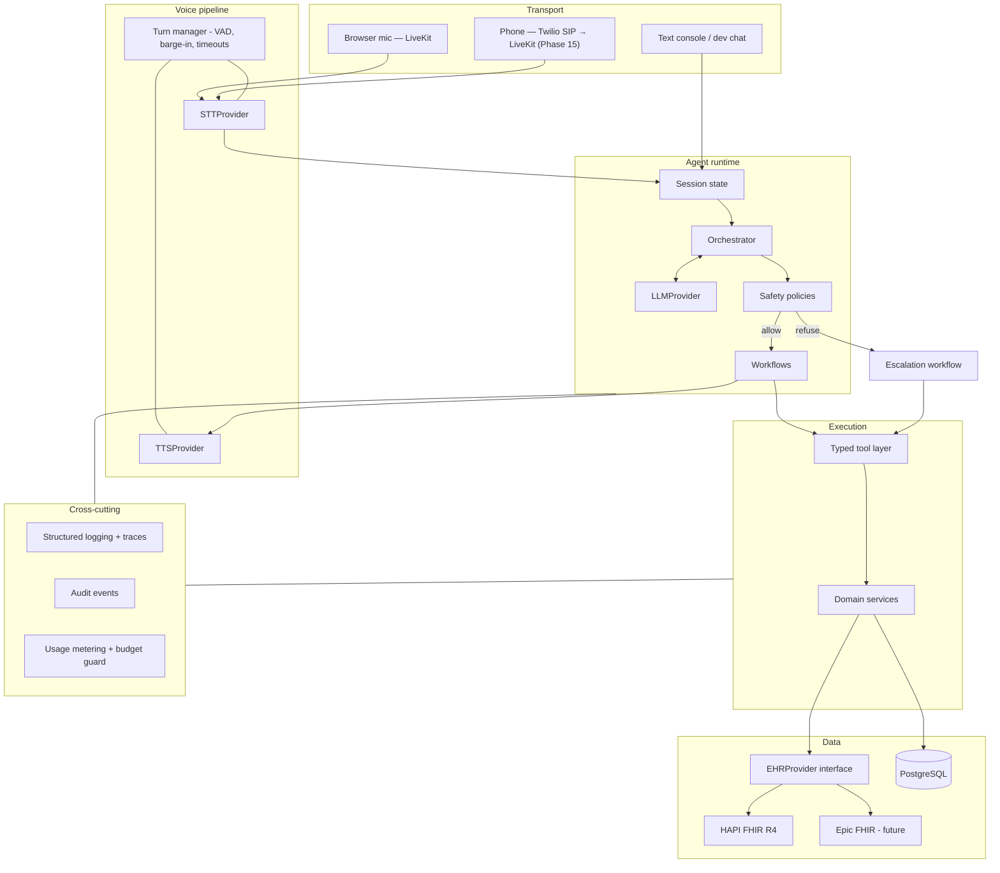
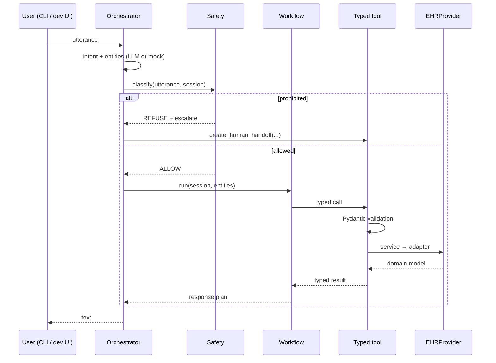
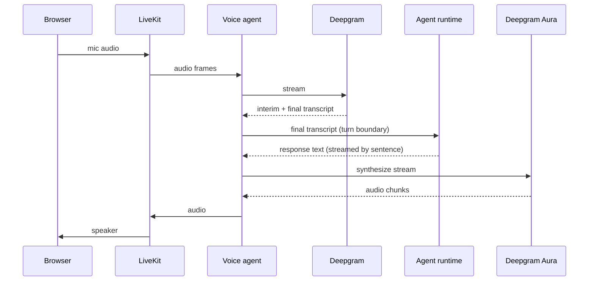
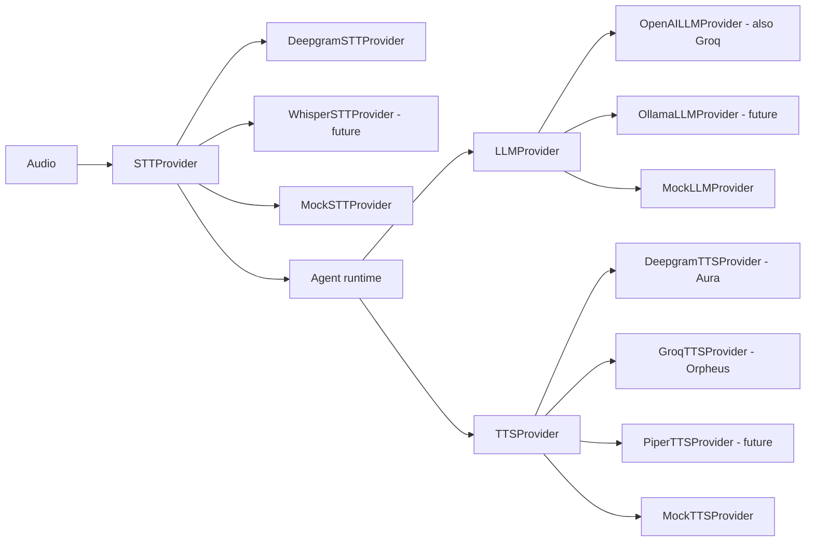
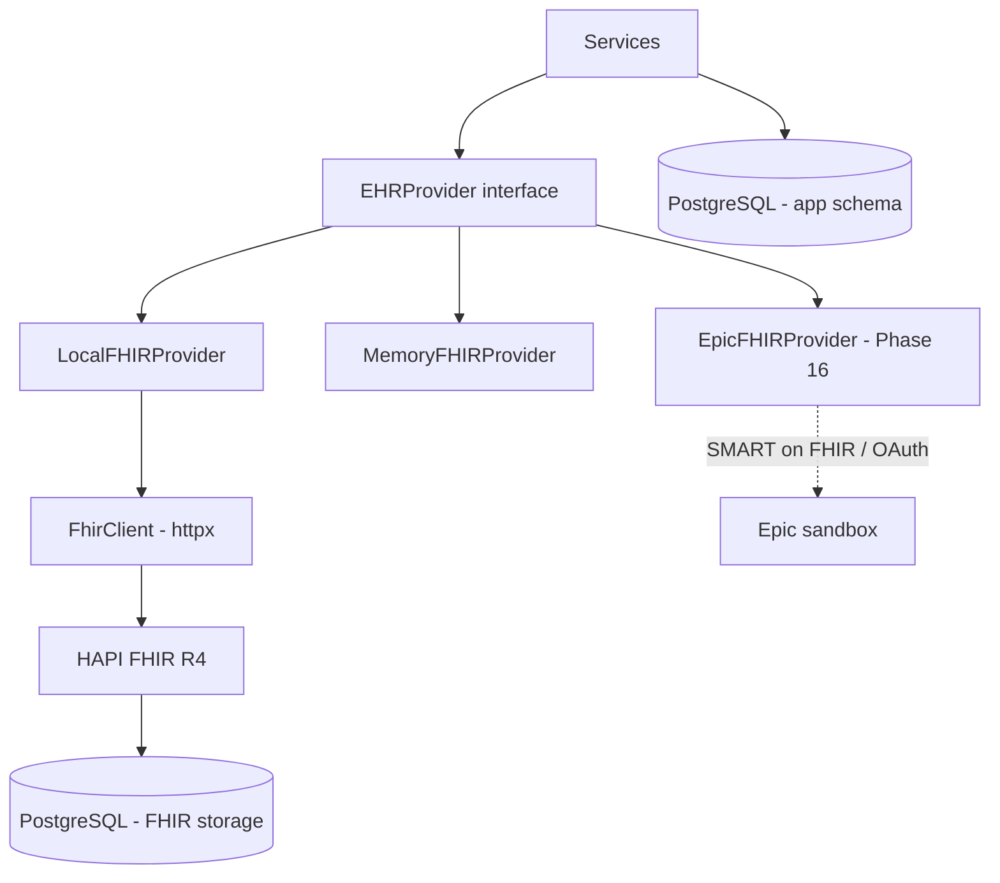

# Architecture

> Companion docs: [AGENTS.md](AGENTS.md) (component roles), [SAFETY.md](SAFETY.md)
> (policy layer), [FHIR.md](FHIR.md) (data layer), [COSTS.md](COSTS.md) (usage + guard),
> and the [ADRs](docs/decisions/) for the reasoning behind each major choice.

## 1. Guiding constraints

Four constraints shape everything below.

1. **The EHR is the source of truth.** The LLM never states a clinical fact it did not
   read from a tool result in the current turn.
2. **The LLM never mutates state.** Writes travel `LLM → typed tool → service → EHR
   adapter → FHIR server`. Every hop validates.
3. **Text and voice share one implementation.** Voice is a transport. If a workflow
   behaves differently over the phone, that is a bug.
4. **Paid providers are optional adapters.** The system must be fully exercisable — and
   fully testable — at $0.

## 2. Layers



### Layering rules

| Layer | May depend on | Must never |
|---|---|---|
| Transport | voice pipeline, runtime entrypoint | know about FHIR or workflows |
| Voice pipeline | provider interfaces | contain business logic |
| Orchestrator | workflows, safety, session state, `LLMProvider` | call FHIR or the DB directly |
| Workflows | tools, session state | import an EHR adapter or vendor SDK |
| Safety | session state, domain models | be bypassable by prompt text |
| Tools | services, Pydantic schemas | contain conversational logic |
| Services | `EHRProvider`, repositories | know which EHR is configured |
| EHR adapters | FHIR client, mappings | leak FHIR types upward |

The rule that carries the most weight: **workflows and agents never query PostgreSQL or
the FHIR server directly.** They go through tools → services → `EHRProvider`.

## 3. The three input paths

### 3.1 Text mode — the default, $0



No STT, no TTS, no audio. Used for ~90–95% of development and for every automated test.

### 3.2 Browser voice — Phase 13



The runtime it calls is *the same object* text mode calls.

### 3.3 Telephony — Phase 15, opt-in

`Patient phone → Twilio number → SIP trunk → LiveKit room → identical voice agent.`
No duplicated business logic. Only the room-join path differs.

## 4. Why STT + LLM + TTS rather than speech-to-speech

See [ADR 004](docs/decisions/004-cloud-ai-providers.md). Summary: a discrete pipeline gives
an inspectable text boundary at every stage, which is what makes tool-call validation,
safety enforcement, transcripts, per-stage latency attribution, per-stage cost
attribution, deterministic tests, and provider swapping possible at all. A single
speech-to-speech model collapses those seams. The interfaces do not preclude adding a
realtime model later as a fourth provider kind.

## 5. Provider abstraction



Three interfaces, in `backend/app/ai/providers/base.py`:

```python
class STTProvider(Protocol):
    async def transcribe_stream(self, audio: AsyncIterator[bytes]) -> AsyncIterator[Transcript]: ...

class LLMProvider(Protocol):
    async def generate(self, req: LLMRequest) -> LLMResponse: ...
    async def tool_call(self, req: ToolCallRequest) -> ToolCallResponse: ...

class TTSProvider(Protocol):
    async def synthesize_stream(self, text: str, voice: VoiceSpec) -> AsyncIterator[bytes]: ...
```

Every implementation reports usage to the metering service. Selection is config-driven
(`AI_MODE`, `LLM_PROVIDER`, `STT_PROVIDER`, `TTS_PROVIDER`); nothing else in the codebase
branches on provider identity.

**Cloud vs local trade-off** (documented for the reader, decided per deployment):

| | Cloud | Local |
|---|---|---|
| Latency | lower, predictable | higher, hardware-bound |
| Tool-calling reliability | strong | weaker, needs stricter repair loops |
| Speech + voice quality | better | acceptable |
| Cost | per-token / per-minute | $0 after hardware |
| Privacy posture | data leaves the boundary | fully on-prem |
| Hardware | none | GPU strongly preferred |
| Deployment | trivial | heavier |

Both are reachable without rewriting the system — that is the point of the abstraction.

## 6. Agent orchestration

Custom explicit state machine, not a general agent framework ([ADR 002](docs/decisions/002-agent-orchestration.md)).

```
SessionState
├── verification: UNVERIFIED | PENDING_SECOND_FACTOR | VERIFIED | FAILED
├── patient_ref: str | None          # set only on VERIFIED
├── active_workflow: WorkflowName | None
├── workflow_state: dict             # slot offers, pending confirmation, ...
├── turns: list[Turn]
└── usage: SessionUsage
```

Per turn: **classify safety → resolve intent → select/continue workflow → execute
deterministic step(s) → render response**. The LLM contributes intent and entity
extraction; everything else is Python, including every word the caller hears.

Rules run first on every turn and are a complete implementation on their own — the model
is asked when they come up empty, may fill a gap they missed, and may never overwrite a
value they parsed. It is never sent the patient's record: only which question the agent
asked, and, for appointment times, which times. Reference resolution ("Tuesday" → a
previously offered slot) is deterministic for that reason. The reasoning and its costs
are in [ADR 008](docs/decisions/008-model-understands-rules-decide.md); the division of
labour is in [AGENTS.md](AGENTS.md).

## 7. Safety layer

Deterministic, evaluated **before** workflow dispatch, and not overridable by conversation
content. Categories: dose modification, medication side effects, diagnosis, treatment,
urgent symptoms, failed verification, patient-requested human, low confidence,
inconsistent records. Outcome is one of `ALLOW`, `ALLOW_WITH_CONSTRAINTS`,
`REFUSE_AND_ESCALATE`. Refusals produce a structured handoff, never a medical answer.
Full policy table in [SAFETY.md](SAFETY.md).

## 8. Data layer



Two databases-worth of concerns, deliberately separated:

- **FHIR storage** — owned by HAPI. Clinical + scheduling resources.
- **Application schema** — owned by us: `session`, `turn`, `audit_event`, `escalation`,
  `refill_request`, `provider_usage`. Never contains a clinical assertion; references
  patients by FHIR id only. Async SQLAlchemy, PostgreSQL in Docker or SQLite without it.

A **turn is the unit of work**: everything a turn produced — the session's state, its
trace, audit events, escalations, refill requests, metered usage — is written in one
transaction when the turn ends. The alternative, awaiting a write at each point of
access, would push async plumbing through the safety layer and the verification service
for no measurable benefit here. The cost is that a crash mid-turn loses that turn's rows,
which is acceptable for a demo and would not be for a regulated audit trail.

`MemoryFHIRProvider` implements the identical interface in-process so the whole system —
and the whole test suite — runs with no Docker and no network. It is a development
convenience, not a second source of truth: seeding produces the *same* resources for both.

## 9. Observability

Structured JSON logs correlated by `session_id`, `call_id`, `turn_id`, `tool_call_id`,
and `patient_ref`. Every turn emits a trace record capturing: transcript, detected intent,
entities, workflow, safety decision, each tool call with arguments and result, final
response, per-stage latency, and estimated turn cost. This record is what the dashboard's
Agent Trace page renders — it exists for debugging first and demo second.

The dashboard is a separate Next.js app that reads the backend's HTTP API **from the
browser**. It holds no business logic and shares no code with the backend; it is a client
like any other, which is why adding it required read endpoints rather than a new path into
the services. Fetching client-side rather than server-side keeps its build hermetic — CI
builds it with no backend running — and turns "the API is down" into a visible message
instead of a broken page.

Audit events carry the `turn_id` that produced them. That single column is what lets the
trace say *this exchange did these things to the record*, using rows written at the point
of access rather than a story reconstructed afterwards.

Latency budget (perceived turn target **0.8–2.0 s**):

| Stage | Target |
|---|---|
| Streaming STT finalisation | 150–400 ms |
| LLM decision / first useful output | 200–800 ms |
| Tool + FHIR round trip (local) | 20–200 ms |
| TTS first audio | 75–300 ms |

Measured, not assumed — instrumentation lands with the pipeline, and optimisation happens
only against recorded numbers ([docs/latency.md](docs/latency.md)).

## 10. Usage metering and the budget guard

Every provider adapter reports units consumed (tokens, audio seconds, characters). The
usage service prices them and appends to `provider_usage`. The budget guard is consulted
**before** any paid call:

- below warn threshold → proceed
- at/above warn → proceed, emit warning, surface on the dashboard
- at/above max → **block optional paid calls**, fall back to mock/local providers, keep
  text mode alive

The guard is a service, not a wrapper around one call site, so it cannot be forgotten.
See [COSTS.md](COSTS.md).

## 11. What is deliberately absent

No Kubernetes, no AWS, no Redis, no vector database, no message queue, and no RAG for
facts that are a lookup in a small structured table. Each of those is a real answer to a
problem this project does not yet have. They will be added when a measured need appears,
and the ADR that adds one will say what that need was.
