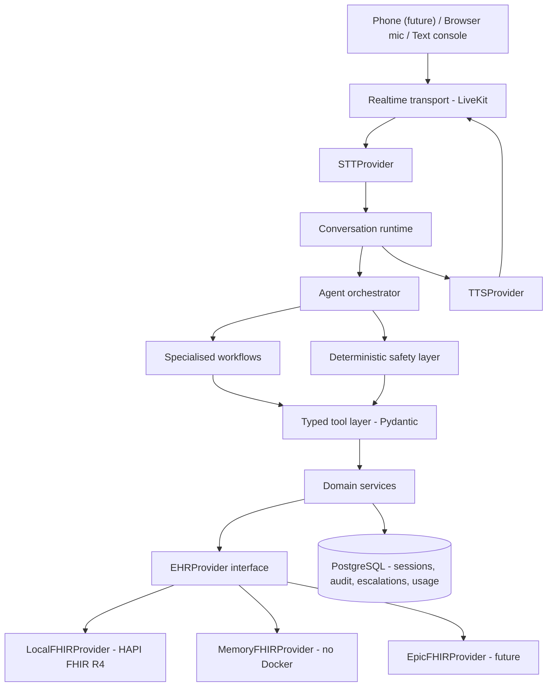

# agentic-patient-access

**CareLine AI** — an agentic AI patient-access platform for a fictional outpatient clinic,
*Oakwood Family Medicine*.

> ⚠️ **Portfolio / demonstration project.** All patient data is **synthetic**. No real
> patient information is used, stored, or transmitted. This project is **not HIPAA
> compliant** and is not intended for clinical use. It demonstrates an *architecture*
> that could be hardened for a regulated environment — see [SAFETY.md](SAFETY.md).

---

## What this is

An AI receptionist that resolves routine **patient-access** workflows end to end —
booking, rescheduling, cancelling, medication instruction lookup, refill requests,
clinic FAQs — by calling **typed tools** against a **FHIR R4** EHR, and that **escalates
to a human** the moment a request crosses into clinical territory.

The framing matters:

> This is **not** "ChatGPT answers clinic calls."
> It is **an AI agent that securely resolves patient-access workflows by interacting with
> healthcare systems through constrained tools.**

The LLM decides *what the caller wants* and *how to say things*. Deterministic Python
decides *what is allowed*, *what the record says*, and *what gets written back*.

## The problem

Outpatient clinics lose a large share of front-desk capacity to a small set of repetitive
calls: "when is my appointment", "I need to move it", "how much of my metformin do I
take", "I need a refill", "are you open Saturday". These calls are high volume, low
complexity, and — critically — **occasionally not administrative at all**. A system that
automates them has to be excellent at the boring 90% *and* reliably recognise the 10%
where a human clinician must be involved.

Inspired by the problem space that Assort Health, Syllable, Hyro, Artera, Talkdesk
Healthcare, Notable, and Hippocratic AI operate in. The implementation and architecture
here are my own.

## How it differs from a generic chatbot

| Generic chatbot | This system |
|---|---|
| Answers from model weights | Answers from the EHR; dosages are read **verbatim** from `MedicationRequest` |
| Free-form text in, text out | Typed, Pydantic-validated tool calls; malformed arguments never execute |
| No identity concept | Session-scoped patient verification gates every PHI-shaped read |
| "Helpfully" answers medical questions | Deterministic safety policies refuse and escalate with a structured handoff |
| Stateless | Stateful conversation + slot-hold + audit trail per turn |
| Opaque | Full agent trace: transcript → intent → workflow → safety decision → tool I/O → latency → cost |

## Architecture at a glance



Full detail, including the text-mode path, the browser-voice path, and the future
Twilio path: **[ARCHITECTURE.md](ARCHITECTURE.md)**.

## Current status

**Phases 0–13 of 18 complete; Phase 14 in progress.** See
[PROJECT_STATUS.md](PROJECT_STATUS.md) for the authoritative, continuously-updated
status, and [ROADMAP.md](ROADMAP.md) for phase acceptance criteria.

Working today, end to end in text **and by voice from a browser microphone**:

- `EHRProvider` interface + two implementations — `MemoryFHIRProvider` (no Docker) and
  `LocalFHIRProvider` (HAPI FHIR R4 over REST) — held to one contract suite
- Session-scoped verification, and access control that refuses on both the unverified and
  the mismatched-patient case
- Booking, rescheduling, cancellation, medication lookup, refill requests, insurance
  cover, clinic FAQ
- A safety layer that refuses clinical questions and escalates them with context
- Voice over a WebSocket: Deepgram streaming recognition in, Deepgram Aura speech out,
  barge-in, silence handling, and a spending cap enforced *during* the call
- Understanding by model with rules as the floor (ADR 008): the model classifies, and
  deterministic Python decides, reads records, and writes every word the caller hears
- An agent runtime with a full per-turn trace, and a text CLI (`make chat`)
- Persistence of sessions, turns, audit events, escalations, refills, and metered spend
- An admin dashboard: overview, calls, agent trace, patients, appointments, escalations

Not built yet: telephony voice, the Epic adapter, and the local-model path. Those are
Phases 15–18 and are deliberately *not* stubbed with fake behaviour.

## Technology

**Backend** Python 3.12, FastAPI, Pydantic v2, SQLAlchemy (async), httpx
**Frontend** Next.js, React, TypeScript (strict), Tailwind
**Data** PostgreSQL, HAPI FHIR R4, Synthea for bulk synthetic patients
**AI (cloud)** Groq or OpenAI (LLM), Deepgram (STT), Deepgram Aura or Groq/Orpheus (TTS)
**AI (local, future)** Ollama/Qwen3, faster-whisper, Piper
**Voice** WebSocket + Web Audio in the browser (ADR 007); Twilio + SIP later
**Ops** Docker Compose, GitHub Actions, ruff, mypy, pytest

Every AI provider sits behind an interface. No business logic imports a vendor SDK —
see [docs/provider-abstraction.md](docs/provider-abstraction.md).

## Cost

Total initial development budget: **$15–$20**, enforced in software, not by discipline.
**Spent to date: $0.51.**

| | |
|---|---|
| HAPI FHIR, PostgreSQL, Synthea, Docker, FastAPI, Next.js | $0 |
| Groq — inference and speech, free tier | $0.00 |
| Deepgram — streaming recognition + Aura speech, against its $200 credit | $0.51 |
| Remaining against the ceiling | $19.49 |

Most development happens in **text mode**, which makes zero paid calls, and the default
configuration cannot construct a paid provider at all. Usage is metered per provider from
the vendor's own numbers, costed, and a **budget guard** blocks optional paid calls at
the ceiling — carried forward across restarts, so the $20 means *this project* rather
than *this boot*. Details and the tracking schema: **[COSTS.md](COSTS.md)**.

## Local setup

Prerequisites: Python 3.12 (or [uv](https://docs.astral.sh/uv/)), Node 20+, and — for the
full stack — Docker Desktop.

```bash
git clone <your-fork> agentic-patient-access
cd agentic-patient-access
cp .env.example .env          # defaults are text-only and cost $0
make install
```

### Without Docker (fastest path)

`EHR_PROVIDER=memory` runs an in-process synthetic FHIR store. Everything except the HAPI
integration tests works.

```bash
make seed        # load the curated clinic + demo patients
make dev         # http://localhost:8000/docs
make test
```

### With Docker (full stack)

```bash
make up          # postgres + hapi-fhir
make wait-fhir   # blocks until /fhir/metadata answers
make seed EHR_PROVIDER=local
make dev
```

| Command | Does |
|---|---|
| `make up` / `make down` | start / stop infrastructure |
| `make logs` | tail infrastructure logs |
| `make reset` | destroy volumes, recreate, reseed |
| `make seed` | load curated clinic, providers, patients |
| `make dev` | run the FastAPI backend |
| `make chat` | talk to the agent in the terminal |
| `make dashboard` | run the admin dashboard (needs `make dev` too) |
| `make test` | run the test suite (no network, no cost) |
| `make budget` | print estimated spend and remaining budget |
| `make lint` / `make typecheck` / `make fmt` | ruff / mypy / format |

### The dashboard

The admin dashboard is a separate Next.js app in [frontend/](frontend/). It reads the
backend's API from the browser, so the backend must be running.

```bash
make dev          # terminal 1 — the API on :8000
make dashboard    # terminal 2 — the dashboard on :3000
```

The Agent Trace page is the one that matters: every field recorded for every turn, from
the safety decision and the rule that fired through to per-stage latency and estimated
cost. Details in [frontend/README.md](frontend/README.md).

### Text mode

Text mode is the default and shares **the same workflows** as voice — there is no second
implementation of the business logic.

```bash
make chat                                  # talk to the agent in the terminal
make chat ARGS="--script demo3 --trace"    # a scripted demo, with the per-turn trace
```

### Voice mode

Voice requires explicit opt-in in `.env`, and the budget guard must have headroom:

```env
TEXT_ONLY_MODE=false
STT_ENABLED=true
TTS_ENABLED=true
AI_MODE=cloud
LLM_PROVIDER=groq
STT_PROVIDER=deepgram
TTS_PROVIDER=groq
```

Then `make dev` and `make dashboard`, and open **/voice**. Use headphones, or check that
the page does not warn about echo cancellation: without it the agent hears itself through
the speakers and interrupts its own sentences.

At those settings the whole voice stack costs **$0.00** — Groq's free tier serves the
model and the speech, and Deepgram's $200 credit covers streaming recognition (COSTS.md).

```bash
make smoke-voice      # one whole call, scripted speech in, real audio out to listen to
```

### Disabling paid providers

Set `AI_MODE=mock` (or leave the three `*_PROVIDER` values at `mock`). Deterministic
scripted providers are substituted, the system stays fully functional in text mode, and
no vendor SDK is ever called. This is what CI uses.

## Safety boundaries

The system distinguishes three categories and treats them differently:

1. **Retrieval of existing medical information** — allowed after verification. Dosage text
   is returned exactly as stored; the LLM may not paraphrase it into new instructions.
2. **Administrative workflows** — allowed. Refill *requests* are created and marked pending
   clinician review; the system never authorises a refill.
3. **New medical or clinical advice** — never. Diagnosis, treatment, dose changes, and
   side-effect triage are refused and escalated with a structured handoff.

Read [SAFETY.md](SAFETY.md) before extending any workflow.

## FHIR

FHIR R4 throughout, against HAPI locally. Resources in use: `Patient`, `Practitioner`,
`PractitionerRole`, `Location`, `Schedule`, `Slot`, `Appointment`, `Medication`,
`MedicationRequest`, `Condition`, `AllergyIntolerance`, `Encounter`. Operation → resource
mapping and example requests: **[FHIR.md](FHIR.md)**.

## Documentation

| Doc | |
|---|---|
| [ARCHITECTURE.md](ARCHITECTURE.md) | System design, all three input paths, layering rules |
| [ROADMAP.md](ROADMAP.md) | 18 phases with acceptance criteria |
| [SAFETY.md](SAFETY.md) | Allowed vs prohibited, escalation triggers |
| [FHIR.md](FHIR.md) | Resources, mappings, example requests |
| [AGENTS.md](AGENTS.md) | Orchestrator vs workflow vs tool vs service vs policy |
| [COSTS.md](COSTS.md) | Budget, metering, guard behaviour |
| [DEMO.md](DEMO.md) | Reproducible demo scripts |
| [PROJECT_STATUS.md](PROJECT_STATUS.md) | Living status |
| [docs/](docs/) | Deep dives + [ADRs](docs/decisions/) |

## Demo

Run `make dev`, `make dashboard`, then `make chat` and watch the call appear on the
dashboard's Calls page and unfold, turn by turn, on Agent Trace. For a booking to show up
on the Appointments page too, run against HAPI (`EHR_PROVIDER=local`): with the in-process
provider the CLI and the API each hold their own store. See [DEMO.md](DEMO.md)
for the scripted scenarios, including the medication-safety escalation.

## Licence

MIT. Synthetic data only.
