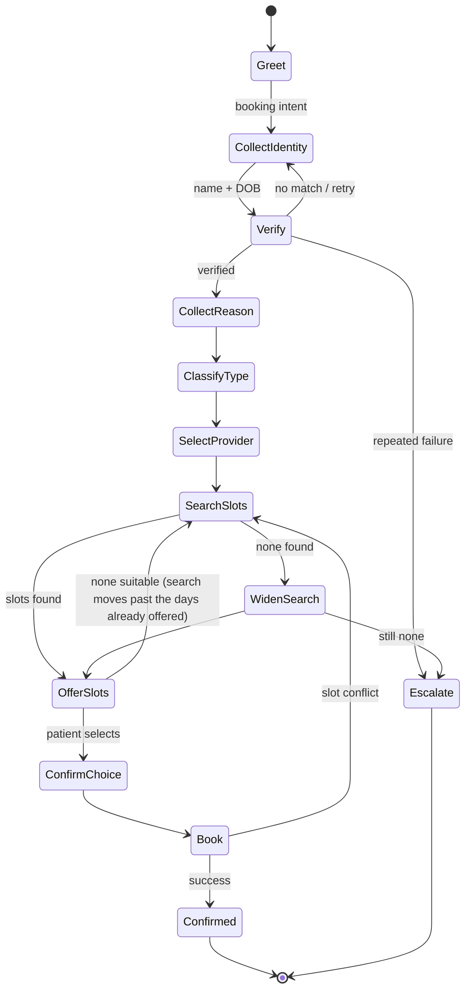

# Call flows

Each flow is an explicit state machine. States are named; transitions are testable.

**The agent speaks first.** A call opens with the clinic's name and the fact that the
caller is talking to software, before anything below has begun — a line that opens in
silence leaves the caller guessing whether it connected, and the ones who guess wrong say
"hello?", which carries no intent. It is speech, not a turn: it never reaches the
orchestrator, and the caller can talk straight over it.

**Three things happen around every flow below.** Safety runs before any of them and can
end the turn on its own. A request the agent cannot serve is answered with an offer of a
person rather than the capability menu. And no reply is ever given three times in a row —
the third identical sentence becomes that same offer, whatever caused the repeat, because
every loop found in a live call looked the same from the caller's side.

## Existing-patient booking



Reason → type → duration:

| Reason | Type | Duration |
|---|---|---|
| First visit | `NEW_PATIENT` | 45 min |
| Routine check-in | `FOLLOW_UP` | 20 min |
| Acute illness | `SICK_VISIT` | 30 min |
| Yearly exam | `ANNUAL_PHYSICAL` | 45 min |
| Diabetes | `DIABETES_FOLLOW_UP` | 30 min |
| Blood pressure | `HYPERTENSION_FOLLOW_UP` | 20 min |
| Medication review | `MEDICATION_FOLLOW_UP` | 20 min |

Classification is LLM-assisted but constrained to this enum; an unmapped reason falls back
to `FOLLOW_UP` and flags the visit note rather than inventing a type.

## New-patient booking

Collect name, DOB, phone, email (optional), reason → create a synthetic `Patient` →
`NEW_PATIENT` (45 min) → search → offer → book. No verification step: the record is being
created, so nothing pre-existing is disclosed.

## Appointment management

```mermaid
stateDiagram-v2
  [*] --> Verify
  Verify --> LoadAppointments: verified
  LoadAppointments --> NoAppointments: none
  LoadAppointments --> Disambiguate: multiple
  LoadAppointments --> Action: exactly one
  Disambiguate --> Action
  Action --> Answer: lookup
  Action --> ConfirmCancel: cancel
  Action --> SearchSlots: reschedule
  ConfirmCancel --> Cancelled
  SearchSlots --> OfferSlots --> Rescheduled
  Answer --> [*]
  Cancelled --> [*]
  Rescheduled --> [*]
  NoAppointments --> [*]
```

Cancellation frees the slot. Rescheduling books the new slot and frees the old one; if the
new booking fails, the original appointment is left untouched.

## Medication lookup

Verify → `get_medications` → match the mentioned drug → return
`dosage_instruction` **verbatim**. Ambiguous match (two similar names) → ask which one.
No match → say so and offer escalation. Missing dosage text → escalate; never assemble one.

## Refill request

Verify → identify medication → locate the **active** `MedicationRequest` → create a
`refill_request` in `PENDING_REVIEW` → confirm it was *sent for review*. If no active
prescription exists, do not create a request — escalate instead.

## Clinic FAQ

Topic → structured clinic data → answer. No verification, no EHR access, no RAG. Unknown
topic → escalate to the front desk.

## Escalation

Reachable from any state, at any time. Captures patient (if verified), verification state,
relevant medication or appointment, the concern, the patient's verbatim question, the
explicit note that no medical advice was given, destination, priority, and the full
transcript. Then it tells the patient plainly what will happen next.
