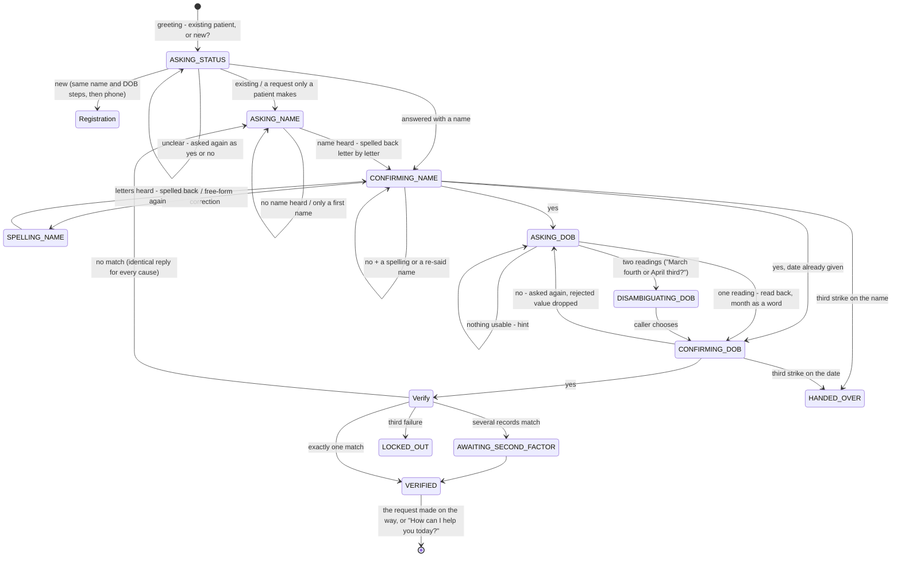
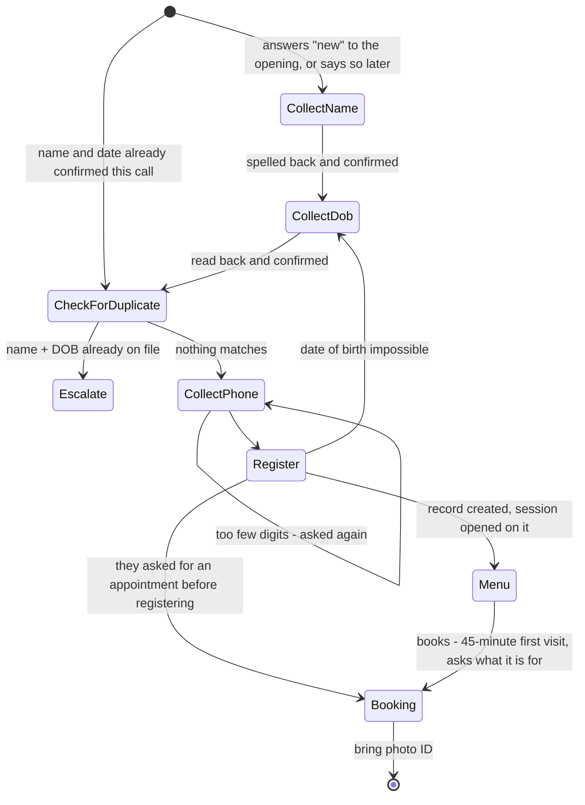
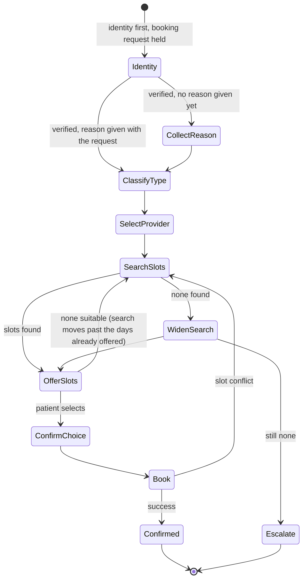

# Call flows

Each flow is an explicit state machine. States are named; transitions are testable.

**The agent speaks first.** A call opens with the clinic's name and the fact that the
caller is talking to software, before anything below has begun — a line that opens in
silence leaves the caller guessing whether it connected, and the ones who guess wrong say
"hello?", which carries no intent. It is speech, not a turn: it never reaches the
orchestrator, and the caller can talk straight over it. It ends by asking whether the
caller is an existing patient or new, because every call now begins with identity
(below), and the answer decides which identity steps follow.

**Every flow below ends the same way.** A completed request asks whether there is
anything else, and the answer is handled by the orchestrator rather than by the workflow
that finished — "no, that's everything" belongs to none of them. No ends the call with a
goodbye; yes asks what else, without reading the capability menu back to somebody who has
just used the agent; and anything that is neither is simply the next request.

**Three more things happen around every flow below.** Safety runs before any of them and can
end the turn on its own. A request the agent cannot serve is answered with an offer of a
person rather than the capability menu. And no reply is ever given three times in a row —
the third identical sentence becomes that same offer, whatever caused the repeat, because
every loop found in a live call looked the same from the caller's side.

## Identity first ([ADR 010](decisions/010-identity-first-opening.md))

Every call, before any workflow. The orchestrator owns it: until the caller is verified,
each turn that safety allows goes to the shared steps in `workflows/identity.py`, which
are shown on the Agent Trace as workflow `identity`.

```mermaid
stateDiagram-v2
  [*] --> ASKING_STATUS: greeting - existing patient, or new?
  ASKING_STATUS --> Registration: new (same name and DOB steps, then phone)
  ASKING_STATUS --> ASKING_STATUS: unclear - asked again as yes or no
  ASKING_STATUS --> ASKING_NAME: existing / a request only a patient makes
  ASKING_STATUS --> CONFIRMING_NAME: answered with a name
  ASKING_NAME --> ASKING_NAME: no name heard / only a first name
  ASKING_NAME --> CONFIRMING_NAME: name heard - spelled back letter by letter
  CONFIRMING_NAME --> CONFIRMING_NAME: no + a spelling or a re-said name
  CONFIRMING_NAME --> SPELLING_NAME: bare no / free-form correction
  SPELLING_NAME --> CONFIRMING_NAME: letters heard - spelled back again
  CONFIRMING_NAME --> ASKING_DOB: yes
  CONFIRMING_NAME --> CONFIRMING_DOB: yes, date already given
  ASKING_DOB --> CONFIRMING_DOB: one reading - read back, month as a word
  ASKING_DOB --> DISAMBIGUATING_DOB: two readings ("March fourth or April third?")
  ASKING_DOB --> ASKING_DOB: nothing usable - hint
  DISAMBIGUATING_DOB --> CONFIRMING_DOB: caller chooses
  CONFIRMING_DOB --> ASKING_DOB: no - asked again, rejected value dropped
  CONFIRMING_DOB --> Verify: yes
  Verify --> ASKING_NAME: no match (identical reply for every cause)
  Verify --> AWAITING_SECOND_FACTOR: several records match
  AWAITING_SECOND_FACTOR --> VERIFIED
  Verify --> VERIFIED: exactly one match
  Verify --> LOCKED_OUT: third failure
  CONFIRMING_NAME --> HANDED_OVER: third strike on the name
  CONFIRMING_DOB --> HANDED_OVER: third strike on the date
  VERIFIED --> [*]: the request made on the way, or "How can I help you today?"
```

- **Strikes** are counted per half: a read-back rejected, or an answer that could not be
  used. Three hand the call to the front desk, audited as `identity.not_confirmed`.
- **Requests made on the way** are kept — "I need to reschedule, my name is John Smith"
  — and acted on the turn the caller is verified.
- **A name and a date in one breath** are both kept, and both still read back.
- **"I'm new"** at any point leaves for registration, which continues from the same
  steps and reuses whatever is already confirmed.
- **Safety still runs first.** An emergency at the name prompt is answered as an
  emergency.
- **`IDENTITY_FIRST_ALLOW_FAQ`** (off by default) answers an opening clinic question
  before a name is taken.

## New-patient registration

The only flow whose precondition is *not* being in the record, and the only one that
writes a `Patient` (ADR 009). A caller must assert that they are new; a failed
verification never arrives here.

Name and date of birth are taken by the identity steps above — spelled back, read
back — not by a copy of them, and skipped entirely when the caller confirmed them
earlier in the call, including in an attempt that then failed to match.

```mermaid
stateDiagram-v2
  [*] --> CollectName: answers "new" to the opening, or says so later
  [*] --> CheckForDuplicate: name and date already confirmed this call
  CollectName --> CollectDob: spelled back and confirmed
  CollectDob --> CheckForDuplicate: read back and confirmed
  CheckForDuplicate --> Escalate: name + DOB already on file
  CheckForDuplicate --> CollectPhone: nothing matches
  CollectPhone --> CollectPhone: part of the number - "go on", joined to the next turn
  CollectPhone --> CollectPhone: too few digits - asked again
  CollectPhone --> Register
  Register --> CollectDob: date of birth impossible
  Register --> Menu: record created, session opened on it
  Register --> Booking: they asked for an appointment before registering
  Menu --> Booking: books - 45-minute first visit, asks what it is for
  Booking --> [*]: bring photo ID
```

Registration ends with what the agent can do for a new patient, not with a booking. A
request made before registering ("I'm new, can I get an appointment?") is acted on
instead. Either way the first booking is the 45-minute new-patient visit, and the
booking workflow runs it exactly as it does for anyone else.

## Existing-patient booking

```mermaid
stateDiagram-v2
  [*] --> Identity: identity first, booking request held
  Identity --> CollectReason: verified, no reason given yet
  Identity --> ClassifyType: verified, reason given with the request
  CollectReason --> ClassifyType
  ClassifyType --> SelectProvider
  SelectProvider --> SearchSlots
  SearchSlots --> OfferSlots: slots found
  SearchSlots --> WidenSearch: none found
  WidenSearch --> OfferSlots
  WidenSearch --> Escalate: still none
  OfferSlots --> ConfirmChoice: patient selects
  OfferSlots --> SearchSlots: none suitable (search moves past the days already offered)
  ConfirmChoice --> Book
  Book --> Confirmed: success
  Book --> SearchSlots: slot conflict
  Confirmed --> [*]
  Escalate --> [*]
```

Reason → type → duration:

| Reason | Type | Duration |
|---|---|---|
| First visit | `NEW_PATIENT` | 45 min |
| Routine check-in | `FOLLOW_UP` | 20 min |
| Acute illness | `SICK_VISIT` | 30 min |
| Yearly exam | `ANNUAL_PHYSICAL` | 45 min |
| Diabetes | `DIABETES_FOLLOW_UP` | 30 min |
| Blood pressure | `HYPERTENSION_FOLLOW_UP` | 20 min |
| Medication review | `MEDICATION_FOLLOW_UP` | 20 min |

Classification is LLM-assisted but constrained to this enum; an unmapped reason falls back
to `FOLLOW_UP` and flags the visit note rather than inventing a type.

## New-patient booking

Collect name, DOB, phone, email (optional), reason → create a synthetic `Patient` →
`NEW_PATIENT` (45 min) → search → offer → book. No verification step: the record is being
created, so nothing pre-existing is disclosed.

## Appointment management

```mermaid
stateDiagram-v2
  [*] --> Identity
  Identity --> LoadAppointments: verified
  LoadAppointments --> NoAppointments: none
  LoadAppointments --> Disambiguate: multiple
  LoadAppointments --> Action: exactly one
  Disambiguate --> Action
  Action --> Answer: lookup
  Action --> ConfirmCancel: cancel
  Action --> SearchSlots: reschedule
  ConfirmCancel --> Cancelled
  SearchSlots --> OfferSlots --> Rescheduled
  Answer --> [*]
  Cancelled --> [*]
  Rescheduled --> [*]
  NoAppointments --> [*]
```

Cancellation frees the slot. Rescheduling books the new slot and frees the old one; if the
new booking fails, the original appointment is left untouched.

## Medication lookup

Identity first → `get_medications` → match the mentioned drug → return
`dosage_instruction` **verbatim**. Ambiguous match (two similar names) → ask which one.
No match → say so and offer escalation. Missing dosage text → escalate; never assemble one.

## Refill request

Identity first → identify medication → locate the **active** `MedicationRequest` → create a
`refill_request` in `PENDING_REVIEW` → confirm it was *sent for review*. If no active
prescription exists, do not create a request — escalate instead.

## Clinic FAQ

Topic → structured clinic data → answer. No EHR access, no RAG. Unknown topic → escalate
to the front desk. Nothing about the answer needs verification, but by default the
question waits until identity is done like any other request; with
`IDENTITY_FIRST_ALLOW_FAQ` an opening clinic question is answered first.

## Escalation

Reachable from any state, at any time. Captures patient (if verified), verification state,
relevant medication or appointment, the concern, the patient's verbatim question, the
explicit note that no medical advice was given, destination, priority, and the full
transcript. Then it tells the patient plainly what will happen next.
